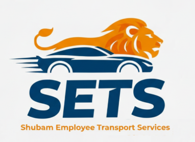

# SETS - Shubam Employee Transport Services



## 📋 Project Overview

**SETS (Shubam Employee Transport Services)** is a modern web application designed to showcase a unique car investment opportunity. The platform provides investors with a transparent view of how they can earn fixed monthly income by investing in vehicles used for corporate employee transportation services.

This project offers a professional, responsive, and visually appealing interface that presents investment details, financial breakdowns, return comparisons, and risk management information in an easy-to-understand format.

## 🚀 Live Demo

The application runs locally at: `http://localhost:5173`

## ✨ Key Features

### 🏠 Home Page
- **Hero Section**: Eye-catching banner with company branding
- **About Us**: Detailed information about the company's 5+ years of experience in corporate transport
- **Services Showcase**: Interactive cards displaying available vehicle investment options
  - Swift Desire Tour S (Active)
  - Maruti Suzuki Ertiga (Coming Soon)
  - Toyota Innova (Coming Soon)
- **Why Choose Us**: Six compelling reasons highlighting the benefits of the investment model
- **Contact Section**: Professional contact cards with phone and email information

### 🚗 Car Details Page
- **Investment Summary**: Quick overview cards showing:
  - Vehicle model
  - Monthly income
  - Annual ROI
  - Entry capital required
- **Financial Breakdown**: Comprehensive analysis including:
  - Investment details (on-road price, down payment, bank loan, EMI)
  - Income analysis (monthly rental, EMI deduction, net cash flow)
- **Return Comparison**: Visual comparison with traditional investment options:
  - Bank FD (8%)
  - Mutual Funds (12%)
  - SETS Model (33% ROI)
- **Risk Management**: Detailed information about:
  - Corporate contracts
  - Insurance coverage
  - GPS tracking
  - Verified drivers
- **Investor Protection**: Clear outline of capital protection measures

### 🎨 Design Highlights
- **Fully Responsive**: Optimized for mobile, tablet, and desktop devices
- **Modern UI**: Clean, professional design with gradient backgrounds and smooth transitions
- **Interactive Elements**: Hover effects, scale animations, and smooth scrolling
- **Accessibility**: Semantic HTML and proper ARIA labels
- **Visual Hierarchy**: Clear information architecture with proper spacing and typography

## 🛠️ Technology Stack

### Frontend Framework
- **React 19.2.0**: Modern JavaScript library for building user interfaces
- **React Router DOM 7.13.0**: Client-side routing for single-page application navigation

### Styling
- **Tailwind CSS 4.1.18**: Utility-first CSS framework for rapid UI development
- **Custom CSS**: Additional styling for specific components

### Build Tools
- **Vite 7.2.4**: Next-generation frontend build tool for fast development
- **@vitejs/plugin-react 5.1.1**: Official Vite plugin for React

### Code Quality
- **ESLint 9.39.1**: JavaScript linting utility
- **eslint-plugin-react-hooks**: Enforces React Hooks rules
- **eslint-plugin-react-refresh**: Ensures React Fast Refresh compatibility

## 📁 Project Structure

```
SETS_project/
├── public/                      # Static assets
│   ├── DesireCar.png           # Swift Desire car image
│   ├── ErtigaCar.png           # Ertiga car image
│   ├── InnovaCar.png           # Innova car image
│   ├── homelogo.jpeg           # Home page hero image
│   ├── intro.png               # About section image
│   └── logo.png                # Company logo
├── src/                        # Source files
│   ├── components/             # React components
│   │   ├── CarDetails.jsx      # Car investment details page
│   │   ├── Home.jsx            # Home page component
│   │   └── Navbar.jsx          # Navigation bar component
│   ├── App.jsx                 # Main application component
│   ├── main.jsx                # Application entry point
│   └── index.css               # Global styles
├── index.html                  # HTML template
├── package.json                # Project dependencies
├── vite.config.js              # Vite configuration
├── eslint.config.js            # ESLint configuration
└── README.md                   # Project documentation
```

## 🚀 Getting Started

### Prerequisites
- **Node.js**: Version 16.x or higher
- **npm**: Version 7.x or higher (comes with Node.js)

### Installation

1. **Clone the repository** (if applicable):
   ```bash
   git clone <repository-url>
   cd SETS_project
   ```

2. **Install dependencies**:
   ```bash
   npm install
   ```

3. **Start the development server**:
   ```bash
   npm run dev
   ```

4. **Open your browser** and navigate to:
   ```
   http://localhost:5173
   ```

### Build for Production

To create an optimized production build:

```bash
npm run build
```

The built files will be in the `dist/` directory.

### Preview Production Build

To preview the production build locally:

```bash
npm run preview
```

## 📱 Responsive Design

The application is fully responsive and optimized for:

- **Mobile devices**: 320px - 767px
- **Tablets**: 768px - 1023px
- **Desktops**: 1024px and above

Tailwind CSS breakpoints used:
- `sm`: 640px
- `md`: 768px
- `lg`: 1024px
- `xl`: 1280px

## 🎯 Investment Model Highlights

### Swift Desire Tour S Investment
- **Entry Capital**: ₹2,30,000 (down payment)
- **Monthly Income**: ₹8,000 (net cash after EMI)
- **Annual ROI**: 33%
- **Loan Tenure**: 4 years (48 months)
- **End Result**: Full ownership of the vehicle + ₹76,000 annual income

### Key Benefits
1. **Low Entry Capital**: Start with just ₹2.3 lakh
2. **Fixed Monthly Income**: Predictable cash flow of ₹8,000/month
3. **Asset Creation**: EMI builds your asset automatically
4. **No Daily Hassles**: Professionally managed operations
5. **Corporate Contracts**: Stable income from fixed yearly agreements
6. **Full Transparency**: All numbers clearly defined upfront

## 📞 Contact Information

For investment inquiries and more information:

**Shubam**
- Phone: +91 91087 63643
- Email: shubhampw@gmail.com

**Tarun**
- Phone: +91 81478 08655
- Email: tarunhlamani17@gmail.com

## 🔧 Available Scripts

| Command | Description |
|---------|-------------|
| `npm run dev` | Start development server with hot reload |
| `npm run build` | Build for production |
| `npm run preview` | Preview production build locally |
| `npm run lint` | Run ESLint to check code quality |

## 🌟 Features in Development

- Maruti Suzuki Ertiga investment option
- Toyota Innova investment option
- Investment calculator
- User dashboard
- Online application form

## 📄 License

This project is private and proprietary.

## 🤝 Contributing

This is a private project. For any suggestions or issues, please contact the project maintainers.

## 📝 Version History

- **v0.0.0** (Current)
  - Initial release
  - Home page with company information
  - Swift Desire investment details page
  - Responsive navigation
  - Contact information section

## 🙏 Acknowledgments

- Built with React and Vite for optimal performance
- Styled with Tailwind CSS for modern, responsive design
- Icons and graphics optimized for web performance

---

**Made with ❤️ by the SETS Team**

*Invest Smart. Earn Fixed. Own Assets.*
